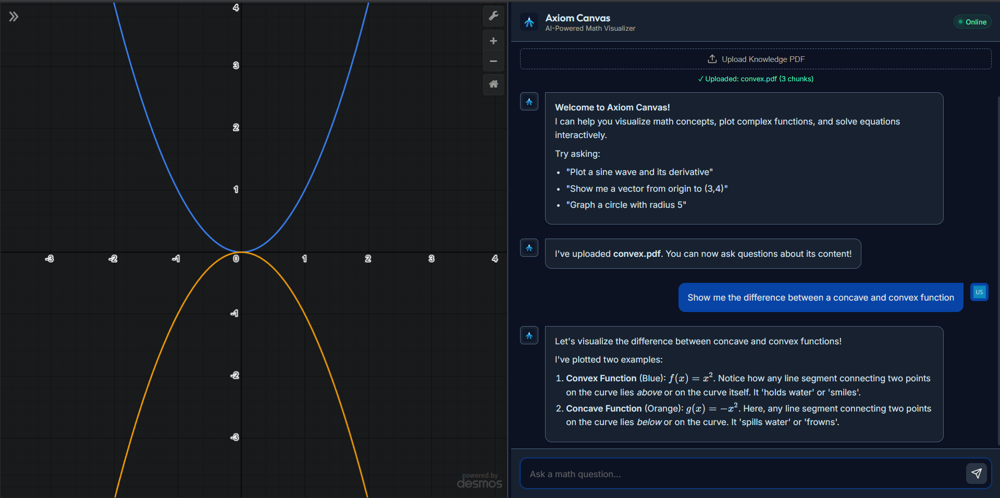

# AXIOM CANVAS


[](https://www.python.org/)
[](https://developer.mozilla.org/en-US/docs/Web/JavaScript)
[](https://flask.palletsprojects.com/)
[](https://deepmind.google/technologies/gemini/)

TRY HERE - https://axiom-canvas.onrender.com/

---


## PREVIEW



---

## OVERVIEW

Axiom Canvas is a high-performance mathematical visualization engine. It integrates natural language processing with precision graphing to facilitate interactive exploration of complex mathematical concepts.

---

## CORE CAPABILITIES

### INTELLIGENT GRAPHING
Translates natural language intent into precise Desmos API commands.
- **CONTEXTUAL PARSING**: Maintains state for iterative graph construction.
- **MULTI-STEP WORKFLOWS**: Handles sequential operations (e.g., plot -> derive -> intersect).

### COGNITIVE INTERACTION
Utilizes Google Gemini 2.0 Flash for mathematical reasoning and contextual explanation.
- **REASONING ENGINE**: Explains mathematical properties alongside visual output.
- **DYNAMIC FEEDBACK**: Adjusts visualizations based on conversational refinement.

### DOCUMENT INTELLIGENCE (RAG)
Retrieval-Augmented Generation for grounding AI responses in external PDF data.
- **VECTOR COMPUTE**: Optimized NumPy-based dot-product engine for similarity search.
- **VISUAL SYNTHESIS**: Maps document concepts directly to coordinate geometry.

---

## TECH STACK

| LAYER | TECHNOLOGY |
| :--- | :--- |
| FRONTEND | Vanilla JS (ES6+), Desmos API v1.9, CSS3 |
| BACKEND | Python 3.9+, Flask, Gunicorn |
| AI ENGINE | Google Gemini 2.0 Flash |
| VECTOR OPS | NumPy (Optimized Dot Product) |
| DEPLOYMENT | Vercel (Serverless), Render (Containerized) |

---

## ENGINEERING HIGHLIGHTS

- **LIGHTWEIGHT RAG**: Custom NumPy implementation replaces heavy FAISS dependencies to meet Vercel's 50MB serverless limit.
- **STATE MANAGEMENT**: Implemented a decision matrix within the system prompt to handle graph persistence and clearing.
- **BRUTALIST UI**: Custom CSS grid system designed for high-contrast, split-pane efficiency.


## LOCAL SETUP

### PREREQUISITES
- Python 3.9+
- Google Gemini API Key

### INSTALLATION

1. CLONE REPOSITORY
   ```bash
   git clone https://github.com/1mystic/axiom-canvas.git
   cd axiom-canvas
   ```

2. INSTALL DEPENDENCIES
   ```bash
   pip install -r requirements.txt
   ```

3. CONFIGURE ENVIRONMENT
   Create a `.env` file in the root:
   ```env
   GEMINI_API_KEY=your_key_here
   FLASK_SECRET_KEY=your_secure_key
   ```

4. EXECUTE
   ```bash
   python api/index.py
   ```

---

## DEPLOYMENT

### RENDER
Uses `render.yaml` blueprint for containerized deployment.

### VERCEL
Optimized for serverless execution.
```bash
vercel --prod
```

---

## LICENSE
[MIT License](LICENSE)

---

**DEVELOPED BY [YOUR NAME]**
[LINKEDIN](https://linkedin.com/in/atharvkhare) | [PORTFOLIO](https://atharvk.me) | [EMAIL](mailto:atharvkhare18@email.com)
